<div align="center">

<!-- ANIMATED CYBERPUNK HEADER -->


<!-- PROFILE VIEWS + FOLLOWERS BADGES -->
<br/>


[](https://github.com/MH-787b)
[](https://github.com/MH-787b)

<!-- ANIMATED TYPING SVG -->
<br/>

[](https://git.io/typing-svg)

</div>

<!-- ANIMATED DIVIDER -->


##  &nbsp; `SYSTEM.profile` &nbsp; 

```js
// Welcome to my digital realm
const MH787b = {
    pronouns: "they" | "them",
    code: ["JavaScript", "TypeScript", "Python", "Rust", "C++"],
    tools: ["React", "Node.js", "Docker", "Git", "Linux"],
    architecture: ["microservices", "event-driven", "serverless"],
    currentFocus: "Building systems that matter",
    funFact: "I debug in my dreams"
};
```

<div align="center">

<!-- ANIMATED WAVE -->


</div>

<!-- ANIMATED DIVIDER -->


##  &nbsp; `STATS.render()` &nbsp; 

<div align="center">

<!-- GITHUB STATS - ANIMATED -->
<a href="https://github.com/MH-787b">
  
  
</a>

<br/><br/>

<!-- STREAK STATS -->
<a href="https://github.com/MH-787b">
  
</a>

<br/><br/>

<!-- ACTIVITY GRAPH -->
<a href="https://github.com/MH-787b">
  
</a>

<br/><br/>

<!-- TROPHIES -->
<a href="https://github.com/MH-787b">
  
</a>

</div>

<!-- ANIMATED DIVIDER -->


##  &nbsp; `TECH.stack` &nbsp; 

<div align="center">

### `// LANGUAGES`


### `// FRAMEWORKS & TOOLS`


### `// DATABASES`


### `// CLOUD & DEVOPS`


</div>

<!-- ANIMATED DIVIDER -->


##  &nbsp; `CONNECT.init()` &nbsp; 

<div align="center">

<!-- SOCIAL BADGES - Customize these URLs! -->
[](https://github.com/MH-787b)

<br/>

<!-- RANDOM DEV QUOTE -->


<br/>

<!-- RANDOM DEV MEME -->


</div>

<!-- ANIMATED DIVIDER -->


<div align="center">

<!-- ANIMATED METRICS IMAGE -->


<br/><br/>

<!-- SPOTIFY - Replace with your own if you have one -->
<!-- [](https://open.spotify.com/user/YOUR_SPOTIFY_ID) -->

</div>

<!-- ANIMATED FOOTER -->


<div align="center">
  
</div>

<!---
  ╔══════════════════════════════════════════╗
  ║  CRAFTED IN THE NEON GLOW OF CYBERPUNK  ║
  ║         github.com/MH-787b              ║
  ╚══════════════════════════════════════════╝
--->
